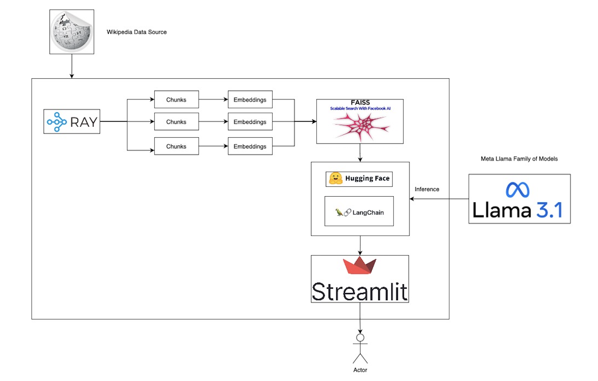

# Scalable RAG-based Wikipedia Assistant

A highly scalable chat assistant that provides real-time Wikipedia information using the `Llama-3.2-3B-Instruct` LLM, inferenced
locally, and implemented on a user-friendly Streamlit interface


## Table of Contents

+ [Architecture Overview](#architecture-overview)
    + [Model Inferencing](#1-model-inferencing)
    + [Application](#2-application)
+ [Demo](#demo)
+ [Prerequisites](#prerequisites)
+ [Application](#application)
    + [Local Deployment](#a-local-deployment)
    + [Docker Deployment](#b-docker-deployment)
+ [Relevance to concpets in the INFO 202 class](#class-concepts)
+ [References](#references)


## Architecture Overview

<div align = "center">
<kbd>

</kbd>
</div>
<br>

### Architecture-Deep-Dive

The engine leverages Wikipedia (and its equivalent Python API) to extract data based on the question a user asks. The relevant results are presisted in FAISS (FB AI Similarity Search) which provides efficient similarity search capabilities, like that of a full-fledged VectorDB. 

Ray (by Anyscale) is used to distribute the workload to chunk and persist the embeddings. While this approach may be be required for a small usecase, at a large scale, distributed computing enables heavy workload completion in significantly lesser time. 

Huggingface Pipelines & Langchain are used in tandem to set model parameters like temprature, token length et al

```
    model_kwargs = {
            "offload_folder": "offload",
            "low_cpu_mem_usage" : "True",
            "temperature": 0.2,
            "do_sample": True,
            "max_length": 800,
        }

    pipe = pipeline(
            task = "text-generation",
            model = model_id,
            max_new_tokens = 800,
            top_p = 1,
            use_fast = True,
            top_k = 10,
            model_kwargs=model_kwargs,
            return_full_text = False,
            repetition_penalty = 1.1,
        )
```

A Rag chain is built to define a sequence of operations to be performed, for e.g.,

```
rag_chain = ({"context": retriever | format_docs, "question": RunnablePassthrough()}
        | qaprompt
        | llm
        | StrOutputParser()
    )
```

### 1. Model Inferencing

The `Llama-3.2-3B-Instruct` model is inferenced on the local machine.


### 2. Application

- **Data Source**: The Wikipedia python library scrapes text data from Wikipedia Pages based on the user's question.

- **Vector Database**: The data from Wikipedia is stored as a FAISS index with the help of Ray, significantly improving the speed of generating and persisting vector embeddings 

- **Prompt**: By utilizing the Langchain wrapper, Hugging Face Pipelines for OpenAI chat completion models, we can infer the hosted Llama model in our Retrieval Augmented Generation (RAG) approach -- using the context from the stored FAISS index and the user's question.

### **Installation**

<ins>Ensure</ins> you accept the terms and conditions of the `Llama-3.2-3B-Instruct` repository on huggingface in order to use the LLM. Once you have the required permissions, export the key as an environment variable - 

```
export HF_TOKEN={your_token}
```
Your model is now ready for use!
<br>
<br>

## Application
For the application, a Streamlit frontend provides a nice, interactive interface for users to input their questions and receive informative answers — you don't have to scour through Wikipedia pages anymore!
<br>

### **a. Local Deployment**

To deploy the application locally - 

1. Create a local python environment - 

```
python3 -m venv env
source /env/bin/activate
```

2. Install the required dependencies for the project - 

```
pip3 install -r requirements.txt
```

3. Run streamlit - 

```
/env/bin/streamlit run app.py
```

The application will now run on your localhost!
<br>


### **b. Docker Deployment**

A Dockerfile is provided to build your own image of the application, to do so run -

```
docker build -t wiki:v1 .
```

To start the application run - 

```
docker run -p 8080:8051 wiki:v1
```

Run the application on localhost:8080 on your web browser.
<br>


## Contributions

This is but a small implementation of the works that are possible through these large language models. Further work on fine-tuning this for specific use cases would be more appropriate, also incorporating larger models, and leveraging cloud providers for deployments.

## Future Work

- Multilingual Capabilities - Advanced Search
- Custom model deployment
- Leveraging a larger LLM for quick, more accurate and efficient search

## Class Concepts

This project discusses information retrieval, semantic similarity, natural language processing techniques (lexical relationships between vocabulary), ranking, and other search evaluation and optimization techniques.

## References

- Pinecone : https://www.pinecone.io/
- FAISS Github : https://github.com/facebookresearch/faiss
- FAISS : https://ai.meta.com/tools/faiss/
- A Resource-Light Method for Cross-Lingual Semantic Textual Similarity -
https://paperswithcode.com/paper/a-resource-light-method-for-cross-lingu
al
- Information Retrieval with BERT :
https://paperswithcode.com/paper/cross-lingual-information-retrieval-with-
bert
- https://arxiv.org/abs/2010.10261